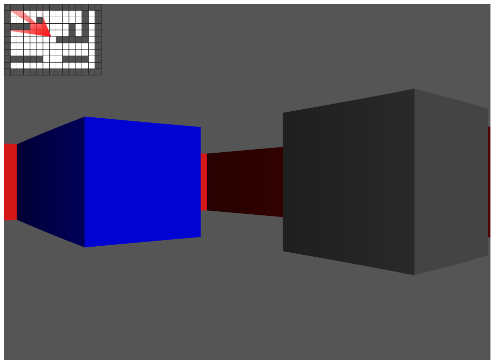

# Raycast Simualtion

A Raycasting simulation written in TypeScript with [p5.js](https://p5js.org/).



# Installing Dependencies

```bash
yarn

// Or..
npm install
```

# Building

```bash
yarn start

// Or..
npm run start
```

# Run Tests

```bash
yarn test

// Or..
npm test
```
